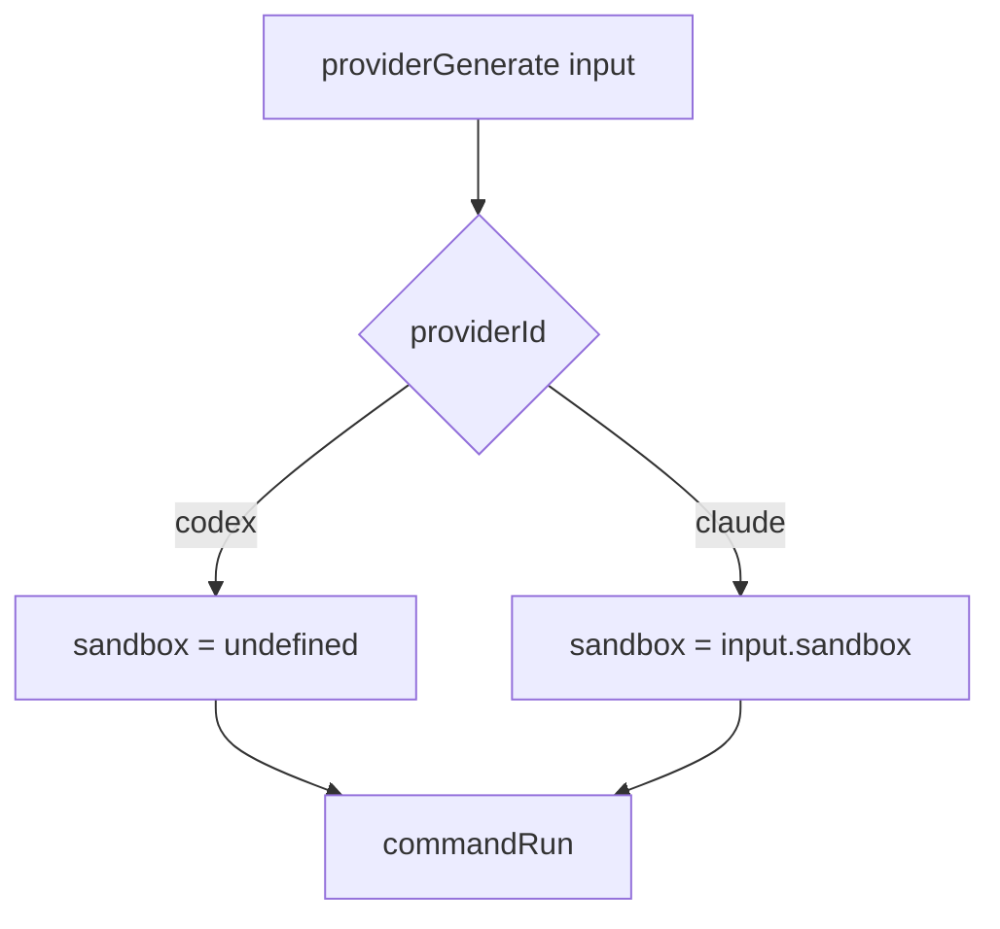

# ProviderGenerate Codex Sandbox Mode

## Summary
- `providerGenerate` now disables the outer wrapper sandbox for `codex`.
- `claude` still runs through the provided wrapper sandbox.
- `codex` keeps using `--dangerously-bypass-approvals-and-sandbox`.

## Flow

