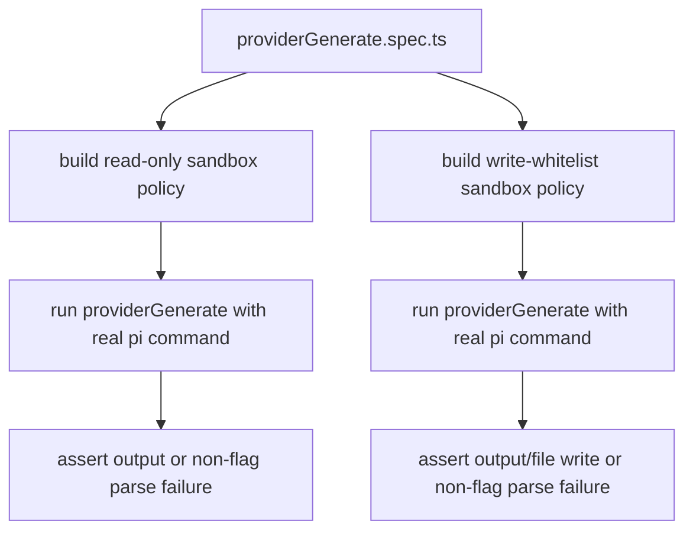

# Provider Generate Integration Tests

`providerGenerate.spec.ts` executes real `pi` CLI runs in sandboxed modes.

## Flow

## Notes

- No mocks are used in this integration spec.
- Tests validate both text-return mode and file-write mode.
