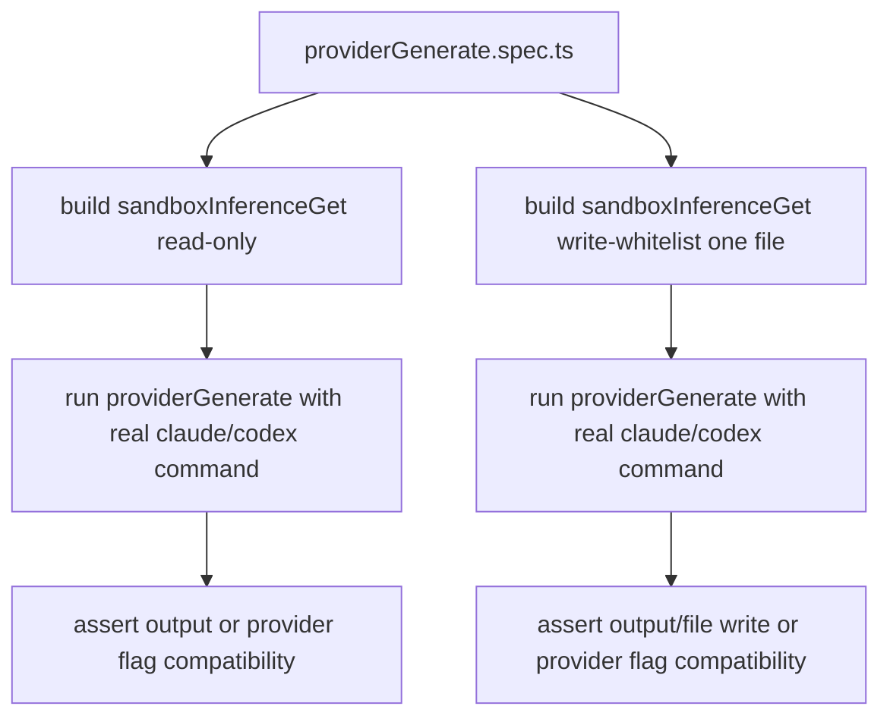

# Provider Generate Integration Tests

Reworked `providerGenerate.spec.ts` to use real provider CLI execution with sandbox policies.

## Flow

## Notes

- No mocks are used in `providerGenerate.spec.ts`.
- Tests execute real provider CLIs in sandboxed modes.
