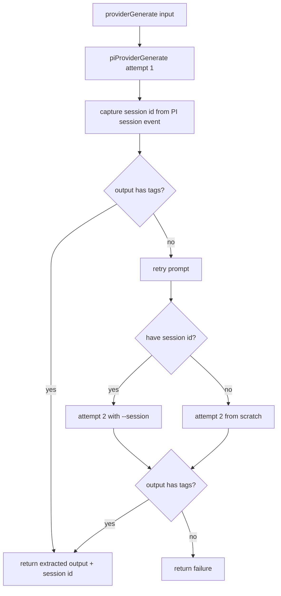

# Provider Generate

`providerGenerate` now executes inference through `pi` in JSON print mode.

## Flow

## Notes

- Invocation uses `pi --mode json --print [--session <id>] [--model ...]`.
- Session id is extracted from PI JSON session events (`id`/`sessionId`).
- Retry resumes using `--session <id>` when available; otherwise it starts a fresh call.
- The selected model is passed from workflow model priority resolution.
- Sandbox execution remains enforced via the outer wrapper.
