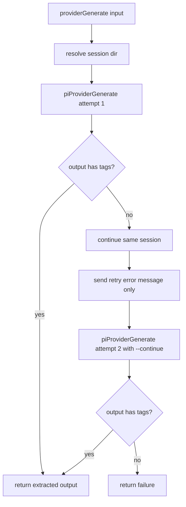

# Provider Generate

`providerGenerate` now executes inference through `pi` in JSON print mode.

## Flow

## Notes

- Invocation uses `pi --mode json --print [--session-dir ...] [--model ...]`.
- Session dir is under `<projectPath>/.beer/local/sessions/<run-id>` where `projectPath` is the active context project path.
- Retry uses the same session dir and `--continue`, with only an explicit error message prompt.
- The selected model is passed from workflow model priority resolution.
- Sandbox execution remains enforced via the outer wrapper.
