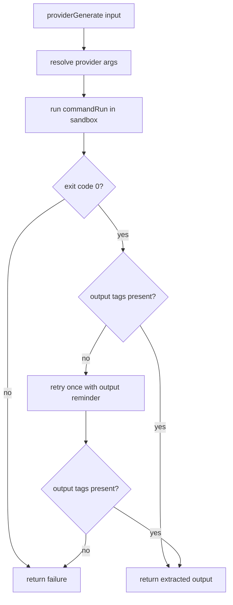

# Provider Generate

Added shared `providerGenerate` for codex/claude CLI inference execution.

## Flow

## Notes

- Uses provider-native non-interactive invocation:
  - Claude: `claude --dangerously-skip-permissions -p <prompt>`
  - Codex: `codex exec --dangerously-bypass-approvals-and-sandbox -- <prompt>`
- Uses provider-specific execution flags per CLI.
- Applies codex env overrides required for sandbox execution.
- Codex execution runs without codex-native sandbox flags and without the outer Anthropic sandbox wrapper.
