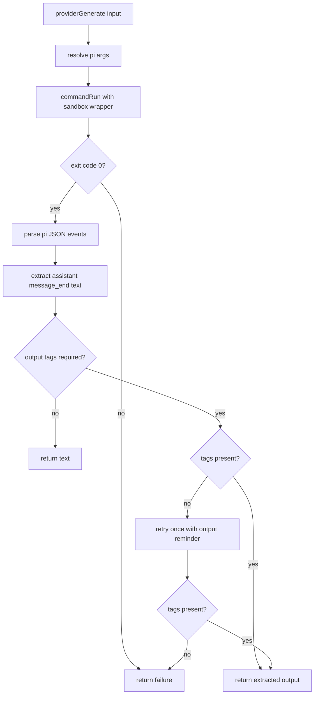

# Provider Generate

`providerGenerate` now executes inference through `pi` in JSON print mode.

## Flow

## Notes

- Invocation uses `pi --mode json --print --no-session [--model ...]`.
- The selected model is passed from workflow model priority resolution.
- Sandbox execution remains enforced via the outer wrapper.
