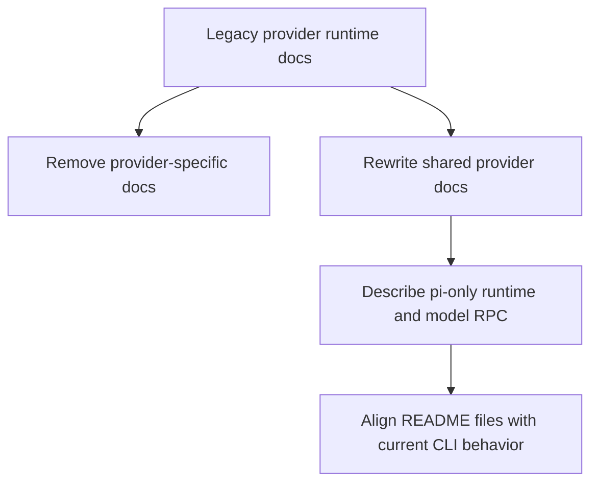

# Provider Legacy Cleanup

Removed stale documentation that described legacy direct provider execution.

## Cleanup Map

## Files

- deleted: two legacy provider-specific docs
- updated: `doc/provider-generate.md`
- updated: `doc/inference-provider-tests.md`
- updated: `doc/context-inference-flow.md`
- updated: `doc/bootstrap-flow.md`
- updated: `doc/provider-generate-integration-tests.md`
- updated: `doc/inference-sandbox.md`
- updated: `README.md`
- updated: `packages/holdmybeer/README.md`
