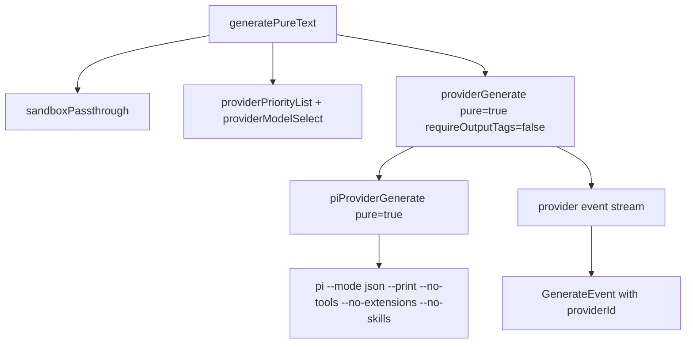

# Pure Inference Mode

## Summary
- Added a pure inference path that disables PI tools, extensions, and skills.
- Added `generatePureText` and `generatePureSessionCreate` for raw prompt flows.
- Kept fail-fast behavior: provider failures still fail the operation.

## Flow

## Notes
- Pure mode sends the prompt unchanged (no sandbox preamble, no output-tag instructions).
- Session continuity is available via `generatePureSessionCreate`.
