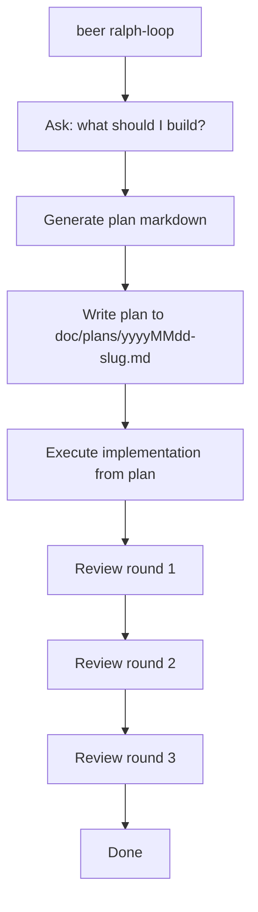

# Ralph Loop Workflow

This document describes the `beer ralph-loop` workflow implemented with built-in model inference.

## Sequence

## Notes

- All phases run through the project's built-in inference pipeline.
- Plan, execution, and reviews are fail-fast; provider errors fail the workflow.
- Execution and review rounds run with write-whitelist access scoped to the selected project path.
