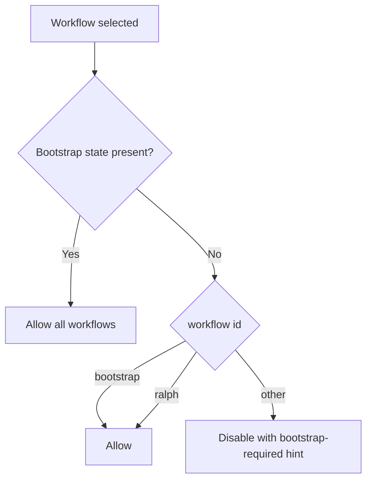

# Ralph Without Bootstrap

The workflow picker now allows `ralph` to run before `.beer` bootstrap settings
are configured.

## Behavior

- `bootstrap`: always available
- `ralph`: always available
- all other workflows: available only after bootstrap state is present

