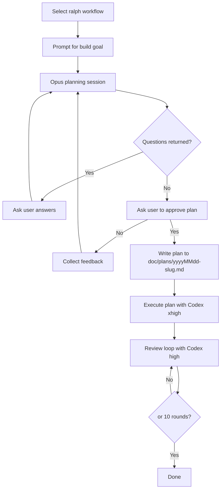

# Ralph Workflow

This document describes the `ralph` workflow selected from `beer`.

## Sequence

## Notes

- Planning runs in read-only mode.
- Execution and review run in write-whitelist mode scoped to the project path.
- The review loop stops early on `<no-issues/>` and has a hard cap of 10 rounds.
