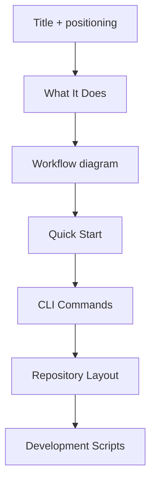

# Main README Refresh

This update improves the root `README.md` with a clearer project narrative, command reference, and workflow visualization.

## Section Structure

## Notes

- Kept all command examples aligned with current scripts and CLI behavior.
- Preserved the single-package workspace framing (`packages/holdmybeer`).
