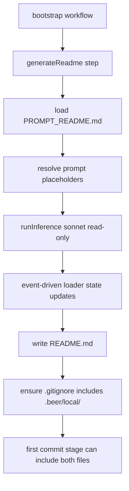

# README Step Move

README generation is now implemented as a workflow step (`generateReadme`) so it participates in step-level inference progress state updates.

## Flow

## Notes

- Added `sources/_workflows/steps/generateReadme.ts`.
- Removed `sources/modules/ai/aiReadmeGenerate.ts`.
- Bootstrap now calls `generateReadme` directly.
- README materialization ensures `.gitignore` before the first commit.
