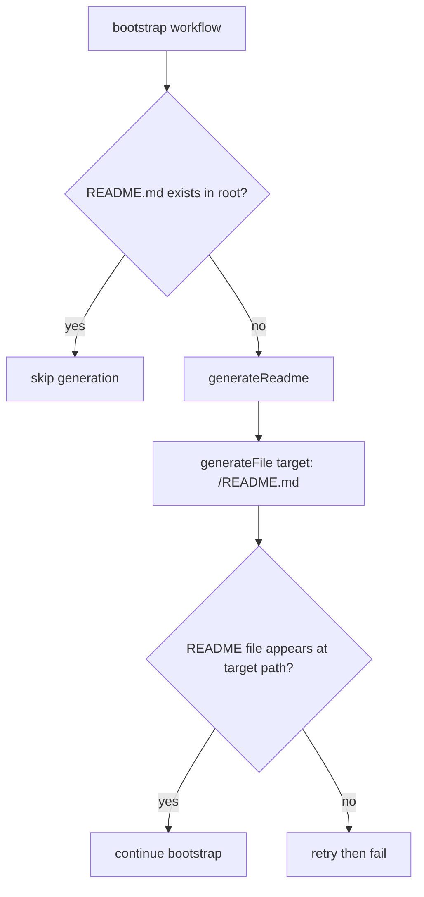

# README Root File Expected Output

`generateReadme` now performs file generation directly and relies on file-expected output mode via `generateFile`.

## Flow

## Notes

- `generateReadme` targets `<project>/README.md` directly.
- The step uses file-expected output mode (no custom `verify` callback).
- `bootstrap` does not write README content manually after inference.
