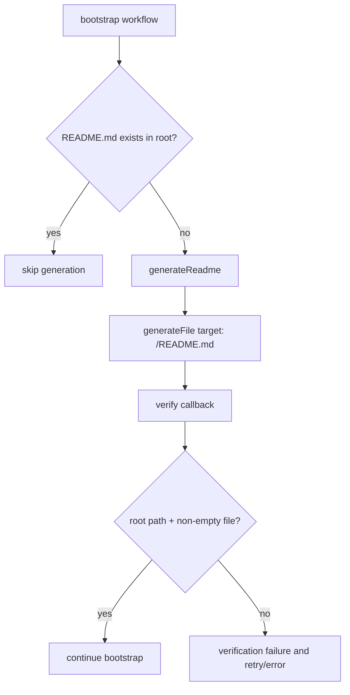

# README Root File Verify

`generateReadme` now performs file generation directly and verifies the generated artifact via `expectedOutput.verify` forwarding in `generateFile`.

## Flow

## Notes

- `generateReadme` now targets `<project>/README.md` directly.
- Verification enforces root path and non-empty file content.
- `bootstrap` no longer writes README content manually after inference.
