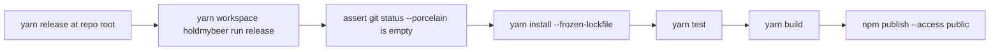

# Release Command

Added a root `yarn release` flow that publishes the `holdmybeer` package.

## Flow

## Files

- Root script: `package.json`
- Package script: `packages/holdmybeer/package.json`
- Release runner: `packages/holdmybeer/sources/release/releaseRun.ts`
- Text catalog entries: `packages/holdmybeer/sources/text/all.txt`
