# Release Command

Added a root `bun run release` flow that publishes the `holdmybeer` package.

## Flow

```mermaid
flowchart LR
  A[bun run release at repo root] --> B[bun --workspaces run release]
  B --> C[assert git status --porcelain is empty]
  C --> D[choose next version patch/minor/major/custom]
  D --> E[npm version X.Y.Z --no-git-tag-version]
  E --> F[git commit release version]
  F --> G[bun run test]
  G --> H[bun run build]
  H --> I[git tag holdmybeer@X.Y.Z]
  I --> J[npm publish --access public]
  J --> K[git push origin HEAD]
  K --> L[git push origin holdmybeer@X.Y.Z]
```

## Files

- Root script: `package.json`
- Package script: `packages/holdmybeer/package.json`
- Release runner: `packages/holdmybeer/sources/release/releaseRun.ts`
- Version mode prompt: `packages/holdmybeer/sources/release/releaseVersionPrompt.ts`
- Semver increment helper: `packages/holdmybeer/sources/release/releaseVersionIncrement.ts`
- Text catalog entries: `packages/holdmybeer/sources/text/all.txt`

## CLI Usage

- Interactive: `bun run release`
- Non-interactive: `bun run release -- <patch|minor|major|custom> [version]`
