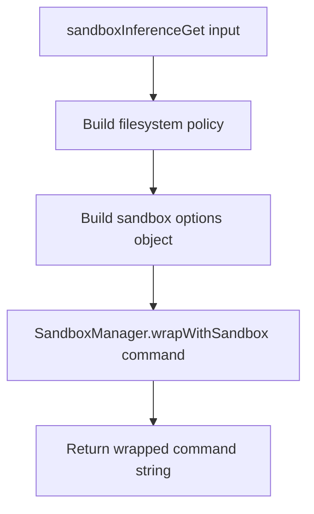

# Sandbox Runtime Via Library

## Summary
- `sandboxInferenceGet` uses `SandboxManager.wrapWithSandbox`.
- The config passed to sandbox runtime is built in-memory from `sandboxInferenceFilesystemPolicy`.
- No explicit network config is passed; network stays unrestricted by this module.
- `enableWeakerNetworkIsolation` is forwarded when provided.

## Flow

