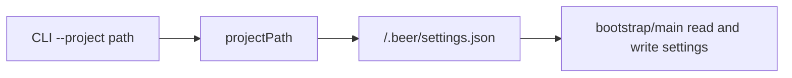

# Project Local Settings

Settings now resolve only inside the current project folder.

## Flow

## Notes

- Removed global settings path resolution under `~/Developer/HoldMyBeerDev`.
- Launcher and workflows now use project-local `.beer/settings.json` paths.
