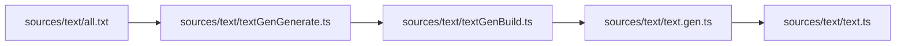

# Text Gen Build

The text catalog now generates a strongly-typed `text.gen.ts` file via a regular build script.

## Flow

## Notes

- `bun run build` runs `bun run text:gen` before TypeScript compilation.
- Placeholder tokens like `{repo}` become typed value objects in `TextValuesByKey`.
- `text.ts` exports typed helpers (`textFormatKey`, typed `beerLog` overloads).
