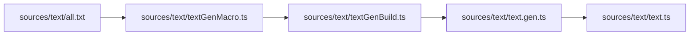

# Text Gen Macro

The text catalog now generates a strongly-typed `text.gen.ts` file using a Bun macro.

## Flow

## Notes

- `text.gen.ts` is generated before build/dev/test/typecheck scripts.
- Placeholder tokens like `{repo}` become typed value objects in `TextValuesByKey`.
- `text.ts` now exports typed helpers (`textFormatKey`, typed `beerLog` overloads).
