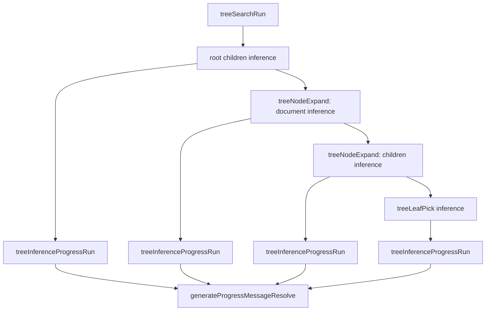

# Tree Search Inference Progress

Tree search now reports progress per inference call using the same event-humanized labels (`thinking`, `working`, `reading files`, `running command`) and token counters used in other inference flows.

## Progress Model

## Implementation Notes

- `treeInferenceProgressRun` wraps exactly one inference call in its own `ctx.progress` line.
- Each call forwards `onEvent` to inference and updates progress text via `generateProgressMessageResolve`.
- Result: tree planning now mirrors standard progress behavior while preserving existing tree orchestration logic.
