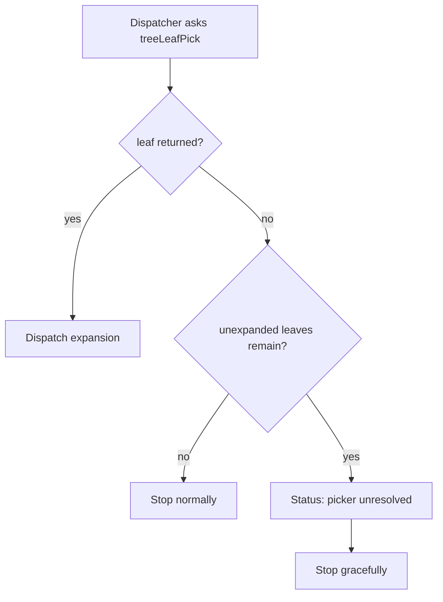

# Tree Search Picker Unresolved Status

When picker inference cannot resolve a valid leaf while unexpanded leaves still exist, tree search now emits an explicit status message before stopping.

## Flow

## Message

- `tree_search_picker_unresolved`
- Text: `Picker could not select a valid leaf; stopping.`
