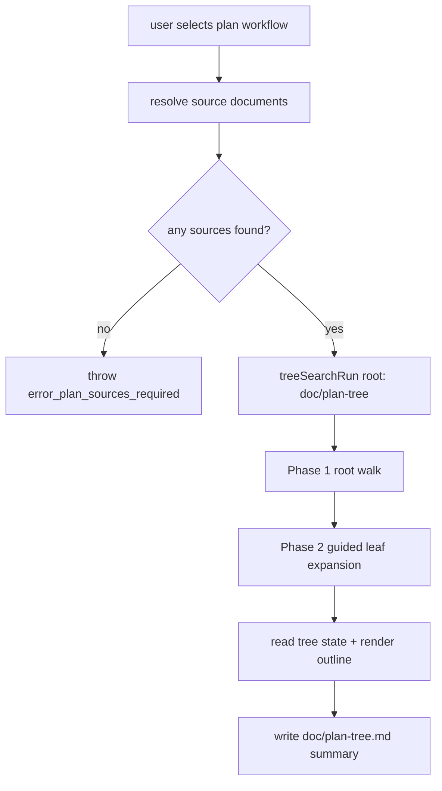
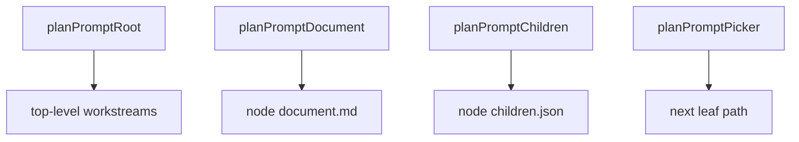

# Plan Workflow: Task Tree Builder

The `plan` workflow builds a persisted implementation-task tree using blueprint and product documentation.

## Flow

## Prompting Model

## Outputs

- Persisted tree root: `doc/plan-tree/`
- Node artifacts:
  - `node.json`
  - `document.md`
  - `children.json`
- Human summary: `doc/plan-tree.md`
