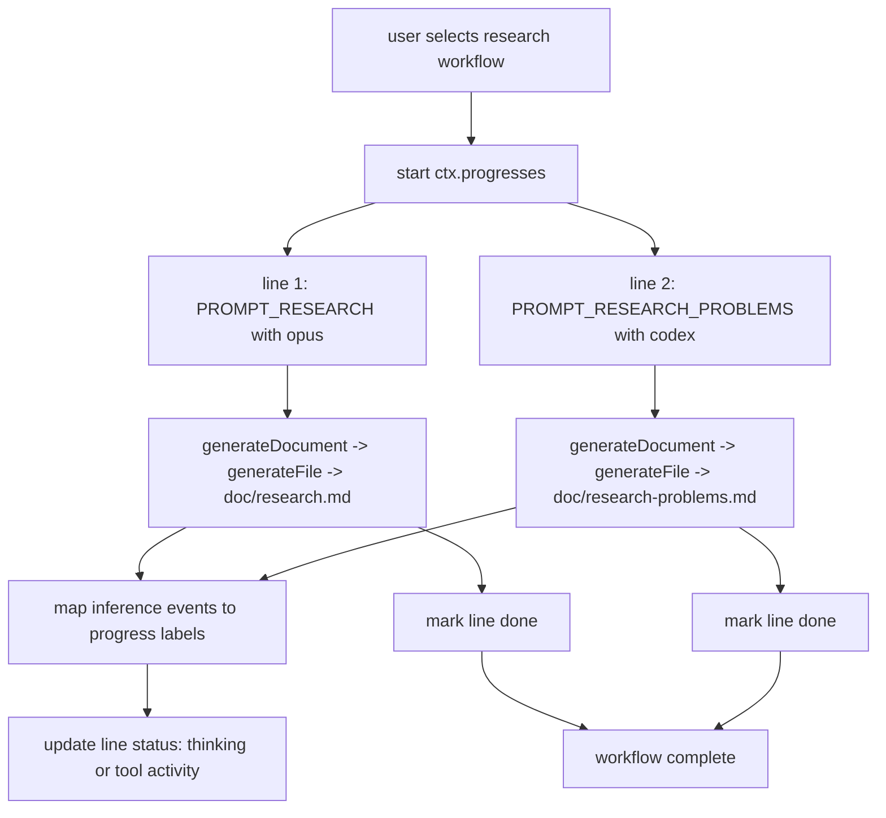

# Research Workflow Parallel Generation

A new workflow runs repository research document generation in parallel using `generateDocument`.

## Flow

## Notes

- Workflow id: `research`.
- Prompt files:
  - `PROMPT_RESEARCH.md`
  - `PROMPT_RESEARCH_PROBLEMS.md`
- Model mapping:
  - Research summary: `opus`
  - Unresolved questions catalog: `codex-xhigh`
- Progress strings are updated from provider events (for example: `thinking`, `reading files`, `running command`).
