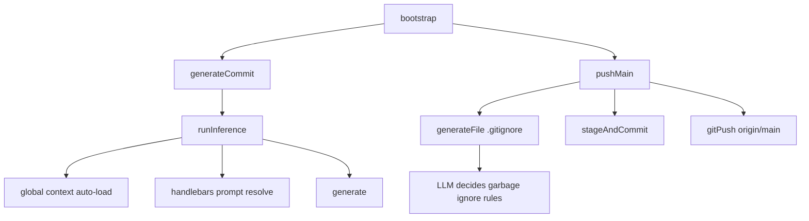

# Workflow Steps Expansion

Added explicit workflow steps for inference, commit generation, and push orchestration.

## Flow

## Notes

- New step files:
  - `sources/workflows/steps/runInference.ts`
  - `sources/workflows/steps/generateCommit.ts`
  - `sources/workflows/steps/pushMain.ts`
- Removed legacy step:
  - `sources/workflows/steps/generateCommitMessage.ts`
