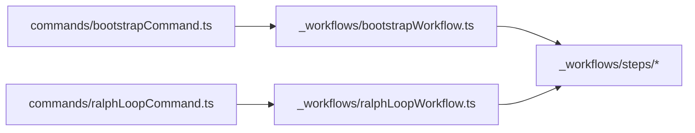

# Workflows Folder Rename

Workflow orchestration has been moved under `sources/_workflows` so the folder stays visually pinned at the top.

## Flow

## Notes

- Renamed folder: `sources/workflows` -> `sources/_workflows`
- `bootstrap` command now imports a workflow entrypoint, same pattern as `ralph-loop`.
